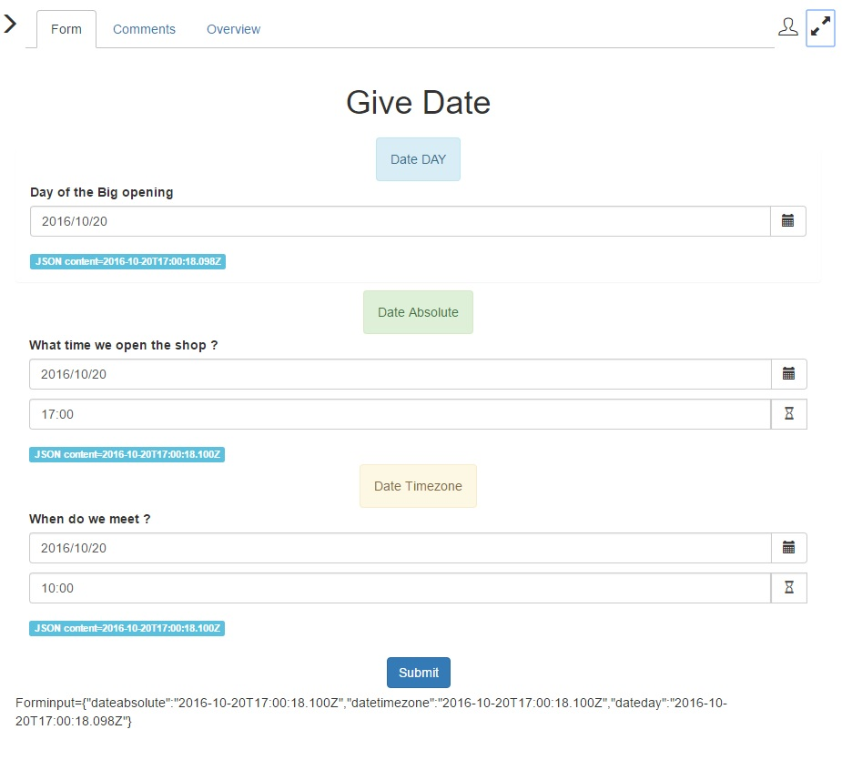

# widget_datetime

A big thanks to Learning Health to produce this widget. This widget manage the Date (and do that correctly over all the time zone : the July 24 will be July 24 over all time zone, and you will have July 24 in your database) and manage the date and the time. Two methods exist for the time point of view : the ABSOLUTE and the TIMEZONE.

This widget can manage 3 different behavior 
--------------------------------------------
* DAY: Only the date can be selected by the user. The date widget return the date as July 24 2016 00:00:00 and this time is saved in the database.
* ABSOLUTE : user want to give an absolute time, like Oct 19 / 10:30 am. This time will be the same over all time zone : if you give this time at San Francisco, open the task at New York or a Grenoble : you will see this time 19/10/2016 10:30. In the database, this is the time saved.
* TIMEZONE : user want to give a time, and when you access it, it should be translated in your time zone. Example, I select July 8 2016 10:00 am in San Franciso, a guy in New York will see then July 8 2016 1:00 pm. A guy in Paris will see July 8 2016 07:00 pm

This properties is set in the widget definition : DAY, ABSOLUTE, TIMEZONE.

Attention : use a string in the contract !
------------------------------------------
In the contract, when you collect the information and you specify this is a DATE, then the BonitaEngine will translate this information according the TimeZone of the server.
Then, when the server receive "2016-10-05T00:00:00.000Z", if the server is on UTC timezone, no change. But if your server is on a different time zone, it will apply a change between the UTC and its time zone : the date changed.
To avoid that, use TEXT in the contract. And in the operation, to update your process variable or BDM attribut, do that in your operation :
MyAniversary TakeValueOf <GroovyScript>
the groovy script is then 

import java.text.SimpleDateFormat;
import java.util.logging.Logger;

// format is "2016-10-11T00:00:00.000Z"
SimpleDateFormat sdf = new SimpleDateFormat("yyyy-MM-dd'T'HH:mm:ss");
return sdf.parse( dateday );
 
 
Use the REST API to get the information
----------------------------------------
Attention, the default REST API wait for a TIME STAMP for the default date picker. You have to return the date as a JSON date.
To do that, use the REST API CONTEXT.
You can use 
- version 2.3, 
- version 2.4 : the REST API CONTEXT return by default the date in TIME STAMP, so define a global context variable where you force the format to "datetime". For example:
  { "dateabsolute":"datetime",
     "dateday":"datetime",
     "datetimezone":"datetime" };
	 

What you will have in your database ? 
--------------------------------------
	DAY : the widget generate a date in UTC at the time given by the user. User select July 24 ? Widget generate "2016-07-24T00:00:00.000Z"
	ABSOLUTE : the widget generate a date in UTC at the time given by the user. User select Oct 19 / 10:30 am ? Widget generate "2016-10-19T10:30:18.100Z"
	TIMEZONE : the widget generate a date in UTC and calcul it according where you are : in San Francisco, user select July 8 10:00, Widget generate "2016-07-08T17:00:18.100Z"